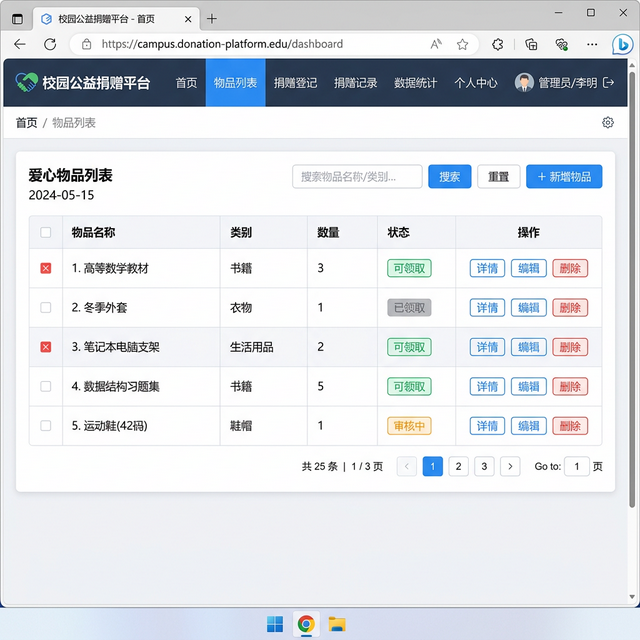
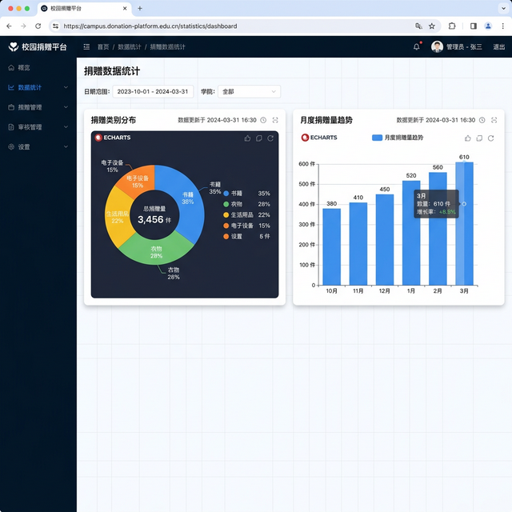

# 校园公益捐赠平台

每学期末，校园里都会有同学清理闲置物品——旧课本、用过的生活用品、穿不下的衣物。多数时候这些东西直接扔掉或堆在寝室角落。想捐给需要的同学，但缺少一个方便的对接渠道——贴公告太麻烦，私聊效率低，信息散落在各个群里很快就被刷没了。本项目搭建了一个 Web 化的校园捐赠平台，捐赠者发布闲置物品信息，需要的同学在线浏览和登记领取，管理员可以统计捐赠数据。

## 痛点与目的

- **问题**：校园闲置物品缺少统一的捐赠渠道，信息发布零散，供需双方对接效率低
- **方案**：用 SpringBoot 做后端 API + Vue 3 做前端界面，搭建校园捐赠信息平台，物品发布、浏览、领取全部在线完成
- **效果**：捐赠者可以发布物品信息（名称、类别、数量、描述），需要的同学浏览列表后登记领取，后台可统计捐赠数据趋势

## 核心功能

- **物品发布**：填写物品名称、类别、数量和描述，发布捐赠信息
- **物品浏览**：查看所有可捐赠物品列表，按状态筛选
- **捐赠记录**：记录每次捐赠的详细信息，包括捐赠人和领取人
- **数据统计**：基于 ECharts 的可视化统计看板，展示捐赠趋势和分类占比

## 系统界面



### 数据统计



## 技术架构

```
Vue 3 前端（Element Plus + ECharts）
    ↓ HTTP API (Axios)
SpringBoot 后端（Spring JDBC）
    ↓ SQL
H2 内存数据库（可切换 MySQL）
```

## 使用方法

### 后端启动

```bash
cd demo3
mvn spring-boot:run
```

后端默认运行在 `http://localhost:8080`，H2 数据库自动建表。

### 前端启动

```bash
cd demo3
npm install
npm run dev
```

浏览器访问 `http://localhost:5173` 进入系统。

## 数据库表结构

### donation_items（捐赠物品）

| 字段 | 类型 | 说明 |
|------|------|------|
| id | BIGINT | 主键自增 |
| name | VARCHAR(100) | 物品名称 |
| category | VARCHAR(50) | 物品类别 |
| description | TEXT | 物品描述 |
| quantity | INT | 数量 |
| status | VARCHAR(20) | 状态（可领取/已领取） |
| create_time | DATETIME | 发布时间 |

### donation_records（捐赠记录）

| 字段 | 类型 | 说明 |
|------|------|------|
| id | BIGINT | 主键自增 |
| item_id | BIGINT | 关联物品 ID |
| donor_name | VARCHAR(50) | 捐赠人 |
| receiver_name | VARCHAR(50) | 领取人 |
| quantity | INT | 领取数量 |
| donation_time | DATETIME | 捐赠时间 |

## 项目结构

```
demo3/
├── src/main/
│   ├── java/com/donation/
│   │   ├── controller/
│   │   │   ├── DonationItemController.java     # 物品接口
│   │   │   ├── DonationRecordController.java   # 记录接口
│   │   │   └── StatisticsController.java       # 统计接口
│   │   ├── model/
│   │   │   ├── DonationItem.java               # 物品实体
│   │   │   └── DonationRecord.java             # 记录实体
│   │   └── service/
│   │       ├── DonationItemService.java        # 物品业务
│   │       ├── DonationRecordService.java      # 记录业务
│   │       └── StatisticsService.java          # 统计业务
│   └── resources/
│       ├── application.properties              # 配置文件
│       └── schema.sql                          # 建表脚本
├── src/views/                                  # Vue 前端页面
│   ├── DonationList.vue                        # 物品列表
│   ├── DonationRecord.vue                      # 捐赠登记
│   ├── DonationRecords.vue                     # 记录查看
│   └── DonationStatistics.vue                  # 统计看板
├── pom.xml                                     # Maven 依赖
├── package.json                                # 前端依赖
└── vite.config.js                              # Vite 配置
```

## 适用场景

- 高校闲置物品捐赠对接
- 社区/社团公益活动物资管理
- 校园二手物品信息平台
- JavaWeb + Vue 全栈开发学习

## 技术栈

| 层级 | 技术 |
|------|------|
| 前端框架 | Vue 3 + Vite |
| UI 组件 | Element Plus |
| 图表 | ECharts |
| HTTP | Axios |
| 后端 | SpringBoot + Spring JDBC |
| 数据库 | H2（开发）/ MySQL（生产） |
| 构建 | Maven + npm |

## 许可证

MIT 许可证
